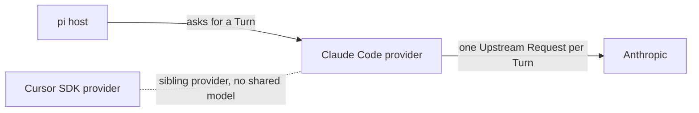

# Context Map

Each package in this monorepo is its own context. A package gets a glossary here when its first domain term is resolved; packages not listed have none yet.

## Contexts

- [Claude Code provider](./packages/pi-claude-code-sdk/CONTEXT.md): gets each pi assistant response from a short-lived Claude Code CLI process billed to the user's Claude subscription.

## Relationships

- **pi host → Claude Code provider**: pi's agent loop asks for one Turn at a time and runs every tool itself.
- **Claude Code provider → Anthropic**: the official Claude Code CLI sends the request; the provider lets exactly one through per Turn.
- **Cursor SDK provider and Claude Code provider**: both are pi providers, but they share no code or terms. Cursor's "Pi tool bridge" runs pi tools during a Cursor run; the Claude Code provider has no bridge.
