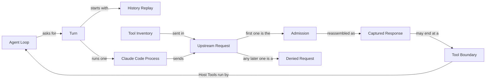
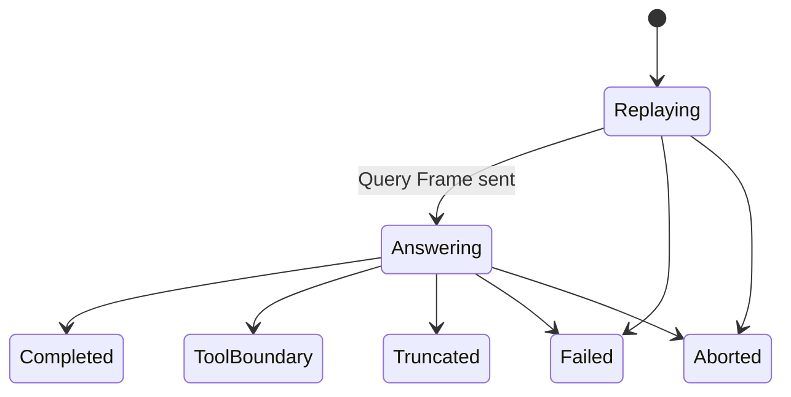

# Claude Code provider

A pi provider that gets each assistant response from a short-lived official Claude Code CLI process, billed to the user's Claude Pro or Max subscription. pi keeps the agent loop, every tool, and the session.

## Model

## Language

### Turn lifecycle

**Turn**:
One assistant response pi asks this provider for. A Turn runs exactly one Claude Code Process and admits at most one Upstream Request.
_Avoid_: request, run, step, generation, call

**Agent Loop**:
pi's cycle of Turns and Host Tool executions. pi owns it; Claude Code never loops.
_Avoid_: model loop, agentic loop

**Claude Code Process**:
The official Claude Code CLI, started for one Turn and gone when that Turn ends.
_Avoid_: native, child, SDK, agent

**Process Directory**:
The one fixed, empty directory every Claude Code Process on the machine runs in. It is not the project directory. Its path appears in the prompt, so it never changes.
_Avoid_: cwd, workspace, sandbox

**Turn Outcome**:
How a Turn ends: Completed, Tool Boundary, Truncated, Failed, or Aborted.
_Avoid_: result, status

**Tool Boundary**:
A Turn that ends because Claude asked for Host Tools. It is the expected way to hand control back to pi, not a failure.
_Avoid_: max-turns error, tool stop

**Truncated**:
A Turn that ends because Claude reached its output-token or context limit.
_Avoid_: length error, cut off

### Admission

**Upstream Request**:
A Messages API request the Claude Code Process sends to Anthropic.
_Avoid_: API call, generation

**Admission Relay**:
The loopback endpoint the Claude Code Process uses as its Anthropic base URL for one Turn. It forwards the Admission and refuses everything after it.
_Avoid_: proxy, gateway, gate

**Admission**:
The single Upstream Request the Admission Relay forwards to Anthropic in a Turn.
_Avoid_: first request, allowed request

**Denied Request**:
Any Upstream Request after the Admission. The Admission Relay refuses it without contacting Anthropic.
_Avoid_: blocked request, retry

**Captured Response**:
The Admission Relay's reassembly of the Admission's streamed answer. It is the source of truth for the Turn's content, stop reason, and token usage.
_Avoid_: final message, native assistant

**Cache Breakpoint**:
The single prompt-cache marker in an Upstream Request's messages.
_Avoid_: cache_control, cache marker

**Stable Prefix**:
The part of an Upstream Request that the next Turn will replay unchanged. The Admission Relay moves the Cache Breakpoint back onto it.
_Avoid_: cached history, prefix

### Tools

**Host Tool**:
A tool from pi's active tool list. Only pi executes Host Tools.
_Avoid_: pi tool, MCP tool, bridged tool

**Tool Inventory**:
The Host Tools advertised to Claude for one Turn, sent in the request's extra body. No MCP server lists them.
_Avoid_: tool list, manifest

**Native Tool Name**:
The name Claude sees for a Host Tool: `mcp__pi__` followed by the Host Tool's name.
_Avoid_: prefixed name, MCP name

### History

**History Replay**:
Rewriting pi's conversation as Claude Code input at the start of every Turn.
_Avoid_: resume, session restore

**Replayed Frame**:
A past message written to the Claude Code Process without asking for an answer.
_Avoid_: history frame

**Query Frame**:
The last user or tool-result message of a Turn, and the only frame Claude answers.
_Avoid_: prompt, final frame

**Replay Acknowledgment**:
The Claude Code Process's zero-turn result confirming it accepted a replayed user message.
_Avoid_: ack

**Same-Route Message**:
An assistant message this provider produced with the current model. Its Signed Thinking replays unchanged.
_Avoid_: native message, carrier

**Foreign Message**:
An assistant message from another provider or model. Its thinking replays as plain text.
_Avoid_: cross-model message

**Signed Thinking**:
Claude's thinking with Anthropic's signature attached. It is valid only in a Same-Route Message.
_Avoid_: reasoning, encrypted thinking

### Models and access

**Subscription Login**:
The Claude Code CLI's own sign-in to a Claude Pro or Max plan, from `claude auth login` or `CLAUDE_CODE_OAUTH_TOKEN`. The provider never reads its credentials.
_Avoid_: API key, credentials, auth token

**Conflicting Override**:
An environment setting that would move the Claude Code Process to API-key billing or another backend, such as `ANTHROPIC_API_KEY` or `CLAUDE_CODE_USE_BEDROCK`.
_Avoid_: bad env, auth conflict

**Model Route**:
The model value the Claude Code CLI accepts, such as `claude-sonnet-5[1m]`.
_Avoid_: native model, alias

**Pi Model ID**:
The model id pi shows for this provider, such as `claude-sonnet-5`. A 1M-context route gets its own id with a `-1m` suffix, such as `claude-sonnet-5-1m`.
_Avoid_: model name, slug

**Pinned Catalog**:
The models this package ships metadata for.
_Avoid_: fallback models, static list

**Picker**:
The account-specific model list the Claude Code CLI reports during its initialize handshake.
_Avoid_: live catalog, model list

**Unpinned Model**:
A Picker model missing from the Pinned Catalog. pi lists it under its Model Route.
_Avoid_: unknown model

**Effort**:
Claude's reasoning-effort setting, derived from pi's thinking level.
_Avoid_: reasoning budget, thinking budget
