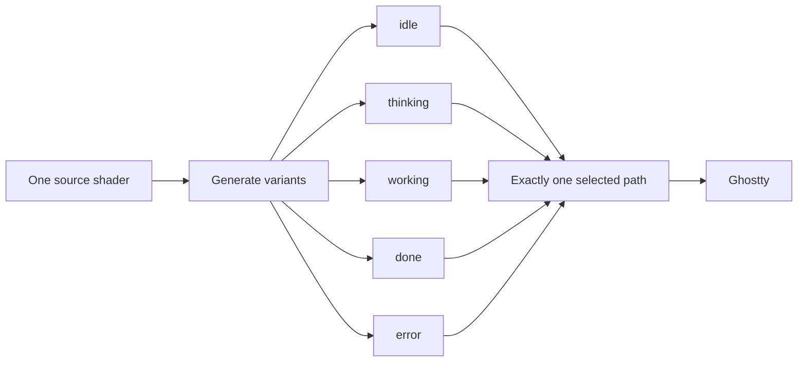

# Visual Model

> The shader contract: variants, placement, and visual invariants.

## 1. Variant model



Variants differ only by `FORCED_STATE`. Change the source, regenerate every variant, and commit them together:

```sh
npm run generate
```

`off` normally removes `custom-shader`; it is not another animated state.

## 2. Placement

The face keeps one height-based size on every display. Surfaces narrower than `3200 px` use the Mac placement: original `16 px × 29` center plus a `30 px` gap for the full animated footprint. Verified `3440 px` ultrawide surfaces use a fixed `184 px` center of Herdr's `36 columns × 8 px` sidebar. Placement deliberately ignores cursor geometry because cursor style and focus can invalidate it. The face always renders on the dense `8 × 17 px` virtual ASCII grid.

## 3. Visual invariants

- Ghostty coordinates are top-down in the tested renderer.
- Shared breathing, drift, gaze, and blink make every state one creature.
- State-specific color and decorations carry the quick read: yellow/question, blue/effort, green/sparkles, red/worry.
- `iFocus == 0` returns the untouched terminal texture.
- Herdr visibility belongs in the controller, never GLSL.

Read [`Architecture`](../ARCHITECTURE.md) before changing control/render boundaries. Read [`Lifecycle`](./lifecycle.md) before changing what a state means.
